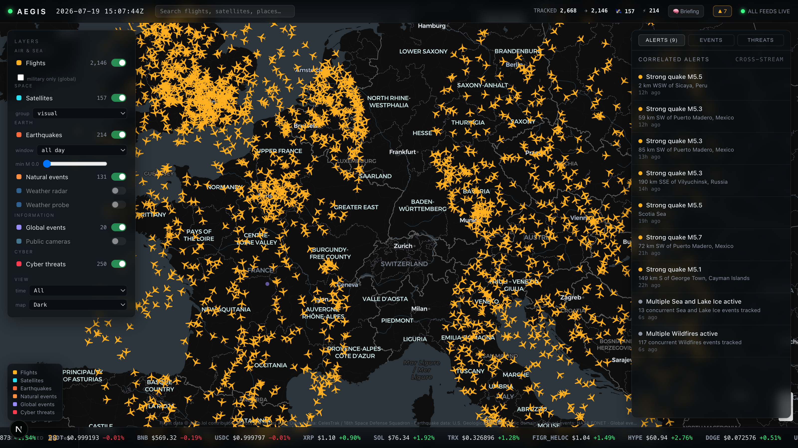

# AEGIS — Real-Time Global Intelligence Dashboard

A live "world monitor" that fuses **free, legal, public open data** onto one dark
command-center map: aircraft, ships, satellites, earthquakes, natural events,
weather, public cameras, global news, markets, cyber threats — plus **cross-stream
alerts** and an optional **local-AI situation briefing**. One browser tab.

<p align="center">
  
  <br><em>Live European airspace, satellites, earthquakes and cross-stream alerts — entirely from free, open data.</em>
</p>

> **Honest framing:** the viral "open-source Palantir / spy-grade surveillance"
> posts that inspired this are hype. AEGIS shows only **publicly broadcast
> signals** (ADS-B, TLE) and **open APIs** — no classified data, no private
> surveillance. It's an OSINT *aggregation* dashboard, done well.

**Runs with ZERO API keys.** `npm install && npm run dev`.

## Features

- 🗺️ Dark command-center map (MapLibre GL + deck.gl, interleaved) with **3 basemaps** (dark / minimal / light)
- ✈️ **Live flights** — heading-rotated aircraft, **dead-reckoned** for smooth motion, viewport-tiled coverage, dual-provider **racing** for low latency; "military only (global)" filter
- 🛰️ **Satellites** — SGP4 orbits propagated in-browser at 1 Hz; click for ground track
- 🌋 **Earthquakes** (USGS) with a magnitude slider and time window
- 🔥 **Natural events** (NASA EONET)
- ⛅ **Weather** — click-to-probe point forecast **+ RainViewer radar overlay**
- 📰 **Global events** — GDELT with a **news-RSS fallback** so the feed is never empty
- 📷 **Public cameras** — TfL London traffic cams (key-free) + global Windy webcams (optional key)
- 💹 **Markets** — crypto ticker + Fear & Greed gauge
- 🛡️ **Cyber threats** — ThreatFox IOCs, **IPs geolocated onto the map**
- 🚨 **Cross-stream alerts** — a correlation engine (major quakes, tsunami flags, cyber concentration, disaster clusters, news⇄quake convergence)
- 🧠 **AI situation briefing** — summarizes the live picture via **local Ollama** (private, free; gracefully off when absent)
- 🔎 **Search** (flights/satellites/places), **time scrubber**, **follow-entity camera**, **shareable URL state**, per-layer live counts, legend, stale/health indicators
- 🔌 **Optional** (free key): AIS ships, hi-res fires, internet outages, air quality

## Quick start

```bash
npm install
npm run dev            # http://localhost:3000
npm test               # unit tests (vitest)
npx playwright test    # e2e smoke (after: npx playwright install chromium)
```

No configuration needed — every core layer works key-free. Copy `.env.example`
to `.env.local` to enable optional layers (AIS ships, FIRMS fires, Windy webcams,
Cloudflare outages, OpenAQ) or a local AI briefing via Ollama.

## Reliability & architecture

```
Browser (client)                         Next.js server (route handlers)
 MapLibre + deck.gl        fetch          in-memory TTL cache (+ disk snapshot)
 ├─ SWR polling / layer                   ├─ circuit breaker + Retry-After backoff
 ├─ satellite.js @1Hz                     ├─ single-flight, stale-on-error
 ├─ flight dead-reckoning                 ├─ /api/<layer> → normalize to one schema
 ├─ correlation → alerts                  └─ /api/health → per-source status
 └─ click → popover / follow                         │  free public upstreams
```

- Every route **proxies + normalizes + caches** an upstream. The cache does
  **single-flight**, **stale-on-error**, and **persists to disk** so a restart
  has data instantly.
- A **circuit breaker** (in `lib/http.ts`) opens when an upstream keeps failing
  (e.g. GDELT 429s), respects `Retry-After`, and lets the cache serve stale —
  so one hostile feed never breaks the dashboard.
- Flights **race** adsb.lol and airplanes.live and take whichever answers first.
- `/api/health` reports per-layer availability, per-source freshness, and
  breaker state.

### Tech stack

Next.js 15 (App Router, TS) · React 19 · MapLibre GL 5 · deck.gl 9 ·
react-map-gl 8 · satellite.js · SWR · Zustand · Vitest · Playwright.

## Known limitations

- **Flights**: no free whole-planet endpoint — coverage is viewport-tiled (dense
  when zoomed to a region; sparser at continental zoom).
- **GDELT** rate-limits hard; the RSS fallback + circuit breaker keep the events
  layer populated regardless.
- **Cyber** IP geolocation uses ip-api's free (non-commercial) batch endpoint.
- Satellite propagation runs on the main thread (capped at 3,000); a Web Worker
  is the next step for the full ~7k Starlink catalog.
- The in-memory/disk cache is per-process; swap `lib/cache.ts` for Redis for
  multi-instance production.

## Deploy

- **Docker**: `docker build -t aegis . && docker run -p 3000:3000 aegis`
- **Vercel**: import the repo (config in `vercel.json`).

## Legal

Built only on free/public open data — see [ATTRIBUTION.md](ATTRIBUTION.md).
Because several sources are non-commercial, **AEGIS is for non-commercial,
educational, and research use.** It uses only intentionally-public cameras and
publicly broadcast signals — never private or unsecured feeds.
